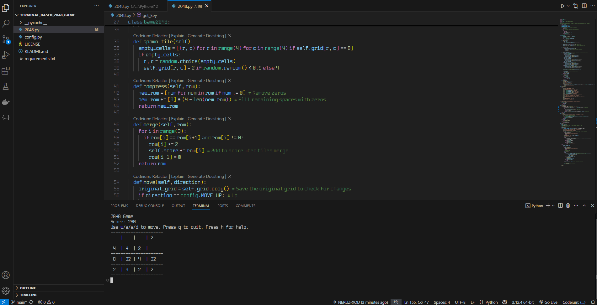
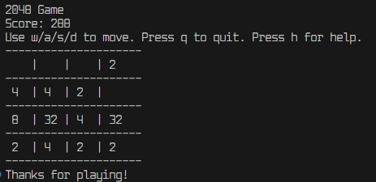
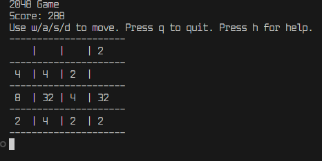
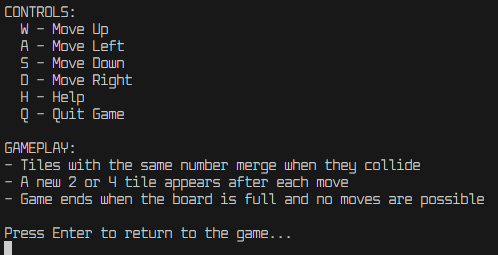

# Terminal-Based 2048 Game

A simple, cross-platform implementation of the popular 2048 game that runs in your terminal.

## Game Overview

2048 is a puzzle game where you combine tiles with the same number to reach the tile with the value 2048. The game is played on a 4×4 grid, and with each move, a new tile randomly appears with a value of either 2 or 4.






## Features

- Clean terminal-based interface
- Score tracking
- Customizable controls
- Cross-platform compatibility (Windows, macOS, Linux)
- Optimized display that only refreshes when necessary

## Requirements

- Python 3.6+
- Required packages listed in `requirements.txt`

## Installation

1. Clone this repository:
   ```
   git clone https://github.com/NERUZ-XOD/terminal_based_2048_game.git
   cd terminal_based_2048_game
   ```

2. Install the required packages:
   ```
   pip install -r requirements.txt
   ```

   **Note for Linux/macOS users**: You may need to run the installation with sudo if you're installing the keyboard module system-wide:
   ```
   sudo pip install -r requirements.txt
   ```

   **Alternative for Linux/macOS users**: If you encounter permission issues with the keyboard module, you can install in user mode:
   ```
   pip install --user -r requirements.txt
   ```

## How to Play

Run the game:
```
python 2048.py
```

### Controls
- **W**: Move tiles up
- **A**: Move tiles left
- **S**: Move tiles down
- **D**: Move tiles right
- **H**: Display help
- **Q**: Quit game

## Cross-Platform Compatibility

This game is designed to work on Windows, macOS, and Linux:

- **Windows**: Uses the keyboard module for real-time input, with msvcrt as a fallback
- **macOS/Linux**: Uses the keyboard module with termios/tty as a fallback
- **All Platforms**: Falls back to standard input (requiring Enter key after each move) if other methods aren't available

The game automatically detects the best input method for your system.

## Customization

You can customize the game by editing the `config.py` file:

```python
# Controls
MOVE_UP = 'w'      # Change to customize the up movement key
MOVE_LEFT = 'a'    # Change to customize the left movement key
MOVE_DOWN = 's'    # Change to customize the down movement key
MOVE_RIGHT = 'd'   # Change to customize the right movement key
HELP = 'h'         # Change to customize the help key
QUIT = 'q'         # Change to customize the quit key

# Game Settings
INITIAL_TILES = 2  # Number of tiles to spawn at game start
TILE_SPAWN_DELAY = 0.2  # Delay after move before spawning new tile
MOVE_DELAY = 0.2   # Delay between moves to prevent multiple keypresses

# Display Settings
CLEAR_COMMAND = 'cls' if __name__ == 'nt' else 'clear'  # Command to clear terminal
CELL_WIDTH = 4     # Width of each cell in the display
```

## Rules
1. Tiles with the same number merge when they collide
2. After each move, a new tile (2 or 4) appears on the board
3. The game ends when the board is full and no more moves are possible
4. The goal is to create a tile with the value 2048

## License

This project is licensed under the MIT License - see the LICENSE file for details.

## Acknowledgments

- Inspired by the original 2048 game by Gabriele Cirulli
- Built with Python and NumPy
